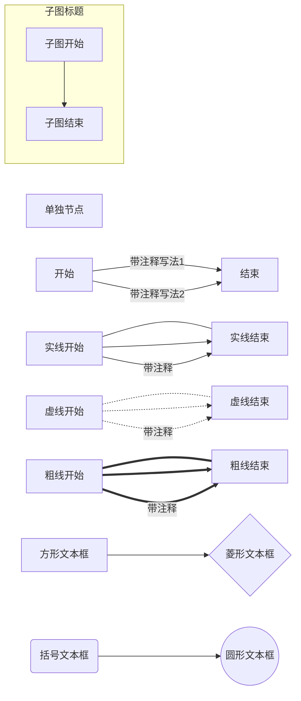

==1.标题==

# 一级标题

##  二级标题

### 三级标题

#### 四级标题

##### 五级标题

###### 六级标题


==2.字体==
*斜体*
**加粗**
***斜体加粗***
~~删除线~~
==高亮==
我是^上标^
我是~下标~

==3.菜单列表==
1)无序列表(加点)

+ 一二三四五
  - 上山打老虎
    * 老虎没打到
      + 打到小松鼠

2)有序列表

1. 一二三四五

2. 上山打老虎

3. 老虎没打到

4. 打到小松鼠


==4.表格==

| MON    | TUE    | WED    | THU    |
| ------ | ------ | ------ | ------ |
| 上山   | 上山   | 上山   | 上山   |
| 打老虎 | 打老虎 | 打老虎 | 打老虎 |


==5.引用==

> 一二三四五
>
> > 上山打老虎
> >
> > > 老虎没打到
> > >
> > > > 打到小松鼠


==6.分割线==

***

***

***

==7.代码==
`单行代码`

```java
public class HelloWorld{
	public static void main(String[] args){
		System.out.println("HelloWorld");
	}
}
```

==8.链接==
[我的博客链接](KyleSun96.github.io)

==9.插入图片==
语法:
床图托管

==10.插入视频==
语法:嵌入代码

==11.Mermaid==

1.  图的方向支持一下几种方式： 
	格式:	graph LR
     TB - 从上到下(top bottom )
     BT - 从下到上(bottom top)
     LR - 从左到右(left right)
     RL - 从右到左(right left)
     TD - 跟 TB 相同	
2. 三种线类型
    --- : 实现
    -.- : 虚线
    === : 粗线
    虚线带箭头的话加 > ，实线和粗线则最后一个字符替换成 >
3. 注释的两种写法
    -- 中间加注释写法 -->
    -->|后边加注释写法|
4. 文本框类型
    [] - 方形文本框
    {} - 菱形文本框
    () - 边角圆滑文本框
    (()) - 圆形文本框
5. 子图
      subgraph 子图标题
        子图开始 --> 子图结束
      end
4. 效果预览

